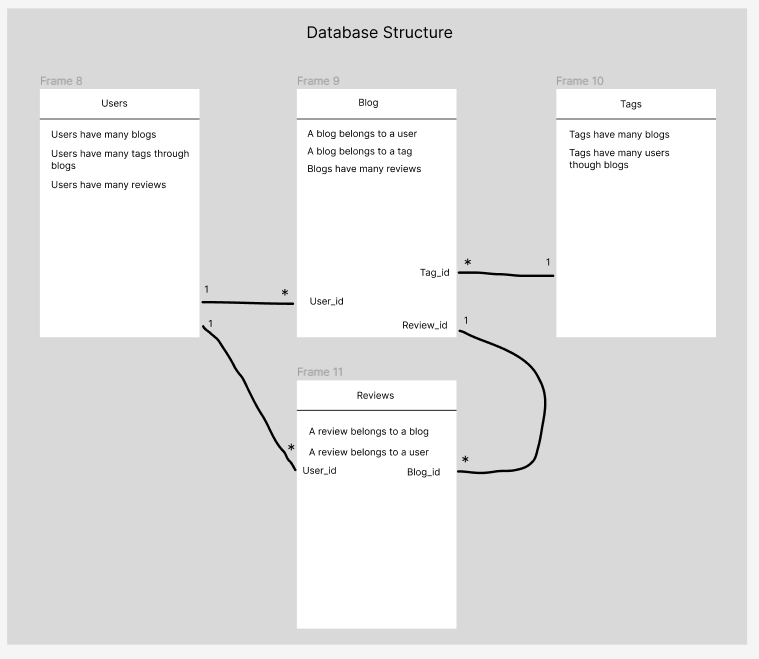
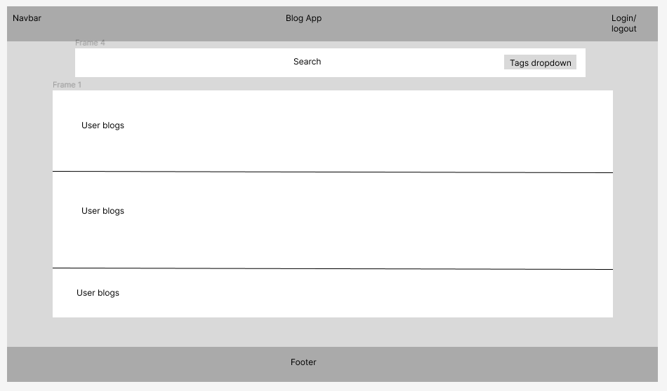

# Blog App

Welcome to Blog App! Blog App is a full stack web application where users can sign up and write blogs. The backend is a full CRUD API using Rails version 7.0.4. The front end is written in JavaScript/React. This is my capstone project for Flatiron's Software Engineering course all written within three weeks.

To run this on your locally on your machine run the following commands in the `blog-app` directory:

* `bundle install`
* `npm install --prefix client`
* `rails db:create`
* `rails db:migrate`
* `rails db:seed`

## Users can... 
* Be signed up and can log in/log out.
* Create, edit, and delete their own blog posts.
* Add tags to a post.
* Search for blog posts and tags.
* Review other user’s blog posts.

## Models and Relationships



### User

A `User` has many `Blogs`, and a `User` has many tags through `Blogs`. A `User` has many `Reviews`.

* id
* first name 
* last name
* email
* password
* avatar 

### Post

A `Blog` belongs to a `User`, a `Blog` belongs to a `Tag`, and a blog has many `Reviews`.

* id
* title
* content
* slug
* user_id
* review_id
* tag_id

### Review

A `Review` belongs to a `Blog` and belongs to a `User`.

* id
* comment
* rating
* blog_id
* user_id

### Tag

A `Tag` has many `Blogs` and a `Tag` has many users through `Blogs`.

* id
* category

## API

Find below a list of the most useful endpoints that can be used with the API.

### GET /api/blogs

Returns a list of all created blogs in the follwoing format

```json
{
  id: 111,
  content: "Blog post here",
  user_id: 4
  review_id: 7,
  tag_id: 1
}
```

### GET /api/blogs/:id

Find a blog by id or by a parameterized slug. Titles are saved in the database as a slug and can be searched by entering the title in lowercase and words seperated by a dash ex. `http://localhost:3000/a-passage-to-india`

### GET /api/reviews

Returns a list off all reviews in the following format.

```json
{
  id: 111,
  comment: "Love the post! Looking forward to the next one!",
  rating: 5,
  blog_id: 7,
  user_id: 1
}
```

### POST /api/reviews

Creates a new review for a blog. Send this data

```json
{
    comment
    rating (integer)
    blog_id (integer)
    user_id (integer)
}
```

and sends back the follwoing data

```json
{
  id: 111,
  comment: "Love the post! Looking forward to the next one!",
  rating: 5,
  blog_id: 7,
  user_id: 1
}
```

### POST /api/users

Creates a new user. Emails and passwords must be unique. Passwords are salted and hashed. To create a new user submit the following attributes:

```json
{
    first_name
    last_name
    email
    password
    avatar
}
```

This is what it returns:

```json
{
  id: 111,
  first_name: "Glen",
  last_name: "Jacobs",
  email: "caleb@wolf.co",
  avatar: "https://robohash.org/quaeprovidentmagni.png?size=300x300&set=set1"
}
```

### GET /api/tags

Returns a list of all tags a user can assign to a blog.

```json
{
    id: 1,
    category: "Fashion"
}
```

## Wireframe / Mockup

### Homepage


### Login / Signup


### Post Blog


### Profile Page


### Any Users Blog Post


## Contact info and other stuff